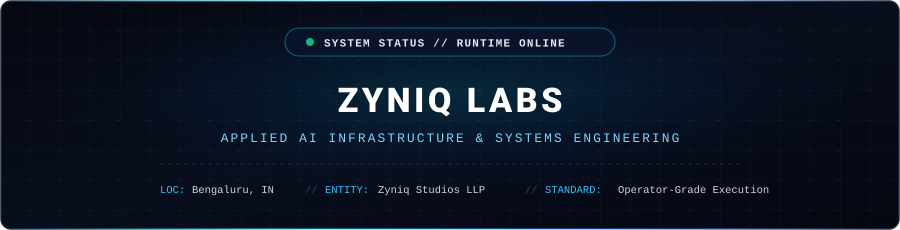
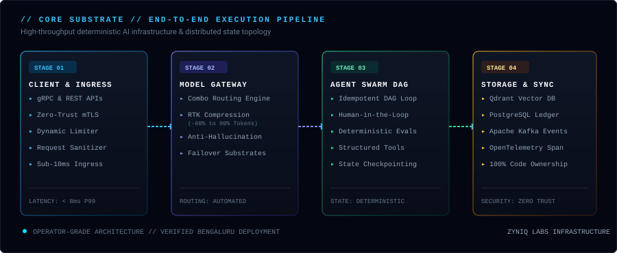
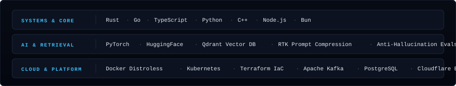

<div align="center">



<br /><br />

<p align="center">
  <a href="https://zyniqlabs.com"><strong>Website</strong></a> &nbsp;•&nbsp;
  <a href="https://zyniqlabs.com/services"><strong>Capabilities</strong></a> &nbsp;•&nbsp;
  <a href="https://x.com/zyniqlabs"><strong>X / Twitter</strong></a> &nbsp;•&nbsp;
  <a href="https://www.linkedin.com/company/zyniqlabs"><strong>LinkedIn</strong></a> &nbsp;•&nbsp;
  <a href="mailto:hello@zyniqlabs.com"><strong>Inquiries</strong></a>
</p>

---

</div>

### Executive Summary

Zyniq Labs architects applied artificial intelligence infrastructure, deterministic workflow automation pipelines, and enterprise software platforms with **100% source code ownership**. 

Operating as **Zyniq Studios LLP** from Bengaluru, India, we build custom intelligence substrates engineered for production scale, operator-grade observability, and deterministic reliability.

---

### Systems Architecture & Execution Pipeline

The Zyniq Labs substrate processes data through a deterministic, four-stage lifecycle designed for high throughput and zero data loss:

<div align="center">
  
</div>

<br />

#### Key Architectural Capabilities:
* **Dynamic Model Gateway:** Latency-optimized combo routing across upstream LLMs, adaptive backoff substrates, and automatic health-checked failover.
* **RTK Prompt Compression:** Proprietary token compression reducing latency and cost by 60% to 90% prior to upstream dispatch.
* **Deterministic Agent DAGs:** Idempotent, state-checkpointed multi-agent execution swarms with auditable human-in-the-loop validation gates.
* **Hybrid Vector & Relational Sync:** Sub-10ms similarity indexing powered by Qdrant combined with transactional ACID durability in PostgreSQL.

---

### Technology Substrates & Tooling

Every component in our stack is chosen for deterministic performance, memory safety, and cloud-native resilience:

<div align="center">
  
</div>

---

### Engineering Doctrine: *Restraint Is Authority*

> *"Trust is not earned through marketing. It is earned through consistent execution, transparent experimentation, and the disciplined refusal to overclaim."*

* **100% Source Code Ownership:** All client platforms, pipelines, and deployment manifests are transferred with complete code ownership, verifiable tests, and zero vendor lock-in.
* **Operator-Grade Reliability:** Systems are architected with explicit memory limits, circuit breakers, and zero-trust mTLS security models.
* **Measurable Verification:** Every operational capability is backed by reproducible benchmarks, property-based tests, and live telemetry.

---

### Corporate Identity & Verification

Zyniq Labs is an officially registered Limited Liability Partnership under the Ministry of Corporate Affairs, Government of India:

```yaml
Entity Legal Name: Zyniq Studios LLP
Registered Base: Bengaluru, Karnataka, India
LLPIN Identifier: ACR-7293
GSTIN Tax ID: 29AAEFZ1877G1ZO
MSME Recognition: UDYAM-KR-09-0036284
```

---

### Operational Channels & Direct Inquiries

* **Engineering Portal:** [https://zyniqlabs.com](https://zyniqlabs.com)
* **General & Sales Inquiries:** [hello@zyniqlabs.com](mailto:hello@zyniqlabs.com)
* **Technical Support:** [support@zyniqlabs.com](mailto:support@zyniqlabs.com)
* **IVR & Telephony:** +91 080 6217 7351
* **Direct Operations (WhatsApp):** [+91 6361612030](https://wa.me/916361612030)
* **Social Dispatches:** [@zyniqlabs on X](https://x.com/zyniqlabs) · [LinkedIn](https://www.linkedin.com/company/zyniqlabs)

<br />

<div align="center">
  <sub>© 2026 Zyniq Studios LLP. All rights reserved.</sub>
</div>
